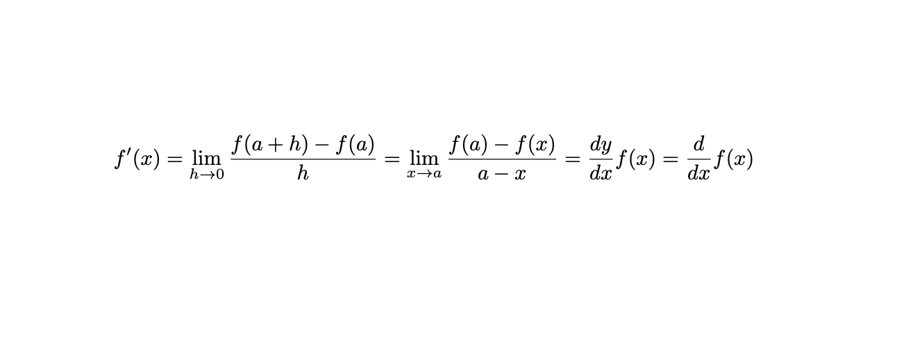

# Notes




# Compiling

Should work with any LaTeX compiler.

I use `tectonic`, and build the LaTeX files with the following shell script:
````shell
$ mkdir -p output
$ tectonic --outdir output source/main.tex
````

Results in `./output/main.pdf`. 

## [Pre-built PDF](./release/main.pdf)

A Pre-built PDF *may be* available under
- [./output/main.pdf](./output/main.pdf)


